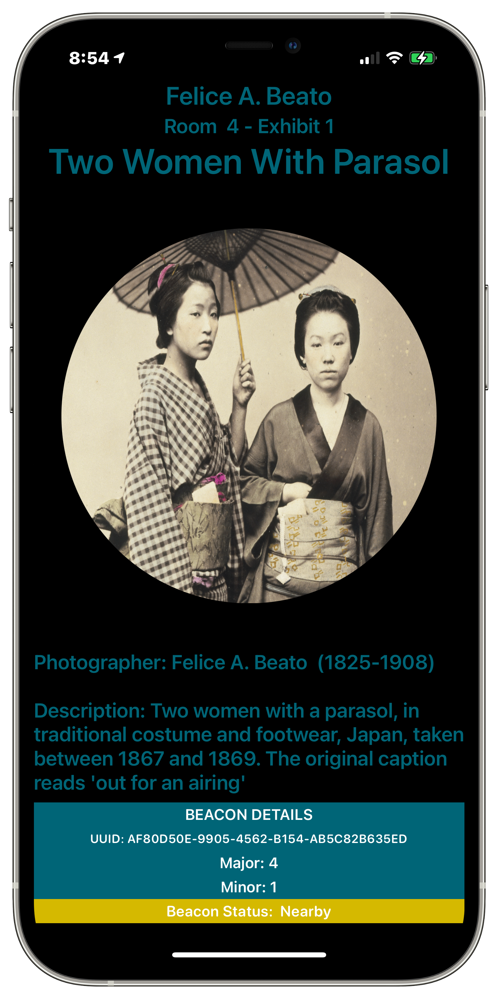
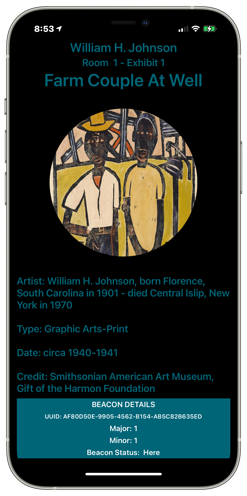

# Beacon Detector
An iOS app that can detect an iBeacon. This app acts as an example museum app that will both display and say details about an art exhibit when the app is near an art exhibit's beacon. 

**Description:** \
The app demonstrates iBeacon detection. When the app is in range of a specific art exhibit containing a beacon, this app will display information about the art. The proximity of the beacon is displayed including "Here", "Nearby", "Far" and "Unknown". The app includes voice synthesis.

This app has a companion app called [Beacon](https://github.com/PepperoniJoe/Beacon) which transmits as an iBeacon that this app can recognize.

**Technical Info:** \
Xcode 12 project written in Swift 5 for iOS 14\
Frameworks: SwiftUI, CoreBluetooth, CoreLocation, AVFoundation

**See Also:** \
[Beacon - companion app that acts as an iBeacon](https://github.com/PepperoniJoe/Beacon)\
[Quickies - a variety of example iOS apps](https://github.com/PepperoniJoe/Quickies)\
 [Make Icons Swiftly - used to generate app icon sets
 ](https://github.com/PepperoniJoe/Make-Icons-Swiftly)

**Author:** \
Marcy Vernon [@MarcyVernon](https://twitter.com/MarcyVernon)

**License:** \
"BeaconDetector" is under the MIT license. See [LICENSE](/LICENSE) for more information.
